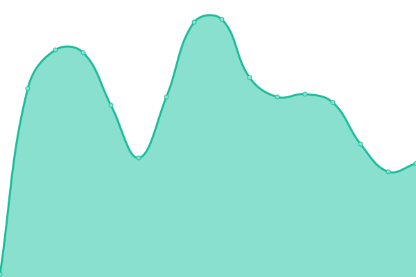

# [📈 Live Status](https://upptime.github.io/upptime): <!--live status--> **🟩 All systems operational**

<!--start: status pages-->
<!-- This summary is generated by Upptime (https://github.com/upptime/upptime) -->
<!-- Do not edit this manually, your changes will be overwritten -->
<!-- prettier-ignore -->
| URL | Status | History | Response Time | Uptime |
| --- | ------ | ------- | ------------- | ------ |
|  Public | 🟩 Up | [public.yml](https://github.com/The-onefit/uptime/commits/HEAD/history/public.yml) | 

 353ms
     
 | 

<a href="https://The-onefit.github.io/upptime/history/public">100.00%</a>
    

|  Portal | 🟩 Up | [portal.yml](https://github.com/The-onefit/uptime/commits/HEAD/history/portal.yml) | 

 412ms
     
 | 

<a href="https://The-onefit.github.io/upptime/history/portal">100.00%</a>
    

|  Training API | 🟩 Up | [training-api.yml](https://github.com/The-onefit/uptime/commits/HEAD/history/training-api.yml) | 

 63ms
     
 | 

<a href="https://The-onefit.github.io/upptime/history/training-api">100.00%</a>
    

|  Shop API | 🟩 Up | [shop-api.yml](https://github.com/The-onefit/uptime/commits/HEAD/history/shop-api.yml) | 

 77ms
     
 | 

<a href="https://The-onefit.github.io/upptime/history/shop-api">100.00%</a>
    

<!--end: status pages-->

[**Visit our status website →**](https://upptime.github.io/upptime)

## 📄 License

- Powered by: [Upptime](https://github.com/upptime/upptime)
- Code: [MIT](./LICENSE) © [Upptime](https://upptime.js.org)
- Data in the `./history` directory: [Open Database License](https://opendatacommons.org/licenses/odbl/1-0/)
